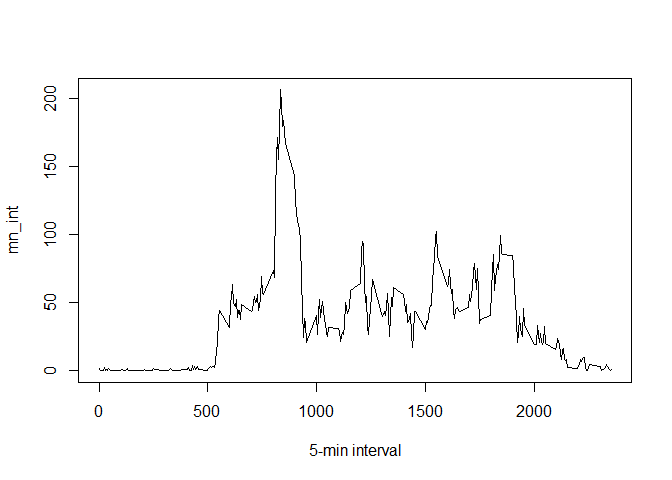

## Loading and preprocessing the data


```r
library(ggplot2)
```

```
## Warning: package 'ggplot2' was built under R version 3.4.4
```

```r
fileUrl <- "https://d396qusza40orc.cloudfront.net/repdata%2Fdata%2Factivity.zip"
download.file(url=fileUrl,destfile="activity.zip",method="auto")

unzip("activity.zip")
activity <- read.csv("activity.csv")
```

## What is mean total number of steps taken per day?


```r
# Group observations by date and sum steps taken per each day
su <- tapply(activity$steps, activity$date, sum, na.rm=T)
hist(su, xlab = "sum of steps per day", main = "histogram of steps per day")
```

<!-- -->

```r
# Define total mean and total median of steps sums for each day
mean_su <- round(mean(su))
median_su <- round(median(su))

print(c("The mean is",mean_su))
```

```
## [1] "The mean is" "9354"
```

```r
print(c("The median is",median_su))
```

```
## [1] "The median is" "10395"
```
## What is the average daily activity pattern?

```r
mn_int <- tapply(activity$steps, activity$interval, mean, na.rm=T)
plot(mn_int ~ unique(activity$interval), type="l", xlab = "5-min interval")
```

<!-- -->

```r
print(mn_int[which.max(mn_int)])
```

```
##      835 
## 206.1698
```

## Imputing missing values

```r
activity2 <- activity  # creation of the dataset that will have no more NAs
for (i in 1:nrow(activity)){
    if(is.na(activity$steps[i])){
        activity2$steps[i]<- mn_int[[as.character(activity[i, "interval"])]]
    }
}

su2 <- tapply(activity2$steps, activity2$date, sum, na.rm=T)
hist(su2, xlab = "sum of steps per day", main = "histogram of steps per day")
```

<!-- -->

```r
mean_su2 <- round(mean(su2))
median_su2 <- round(median(su2))

print(c("The mean is",mean_su2))
```

```
## [1] "The mean is" "10766"
```

```r
print(c("The median is",median_su2))
```

```
## [1] "The median is" "10766"
```

```r
#compare the new values with the "old" values
df_summary <- rbind(data.frame(mean = c(mean_su, mean_su2), median = c(median_su, median_su2)))
rownames(df_summary) <- c("with NA's", "without NA's")
print(df_summary)
```

```
##               mean median
## with NA's     9354  10395
## without NA's 10766  10766
```

```r
summary(activity2)
```

```
##      steps                date          interval     
##  Min.   :  0.00   2012-10-01:  288   Min.   :   0.0  
##  1st Qu.:  0.00   2012-10-02:  288   1st Qu.: 588.8  
##  Median :  0.00   2012-10-03:  288   Median :1177.5  
##  Mean   : 37.38   2012-10-04:  288   Mean   :1177.5  
##  3rd Qu.: 27.00   2012-10-05:  288   3rd Qu.:1766.2  
##  Max.   :806.00   2012-10-06:  288   Max.   :2355.0  
##                   (Other)   :15840
```
## Are there differences in activity patterns between weekdays and weekends?


```r
activity2$weekday <- c("weekday")
activity2[weekdays(as.Date(activity2[, 2])) %in% c("Saturday", "Sunday", "samedi", "dimanche", "saturday", "sunday", "Samedi", "Dimanche"), ][4] <- c("weekend")
table(activity2$weekday == "weekend")
```

```
## 
## FALSE  TRUE 
## 12960  4608
```

```r
activity2$weekday <- factor(activity2$weekday)

activity2_weekend <- subset(activity2, activity2$weekday == "weekend")
activity2_weekday <- subset(activity2, activity2$weekday == "weekday")

mean_activity2_weekday <- tapply(activity2_weekday$steps, activity2_weekday$interval, mean)
mean_activity2_weekend <- tapply(activity2_weekend$steps, activity2_weekend$interval, mean)

library(lattice)
df_weekday <- NULL
df_weekend <- NULL
df_final <- NULL
df_weekday <- data.frame(interval = unique(activity2_weekday$interval), avg = as.numeric(mean_activity2_weekday), day = rep("weekday", length(mean_activity2_weekday)))
df_weekend <- data.frame(interval = unique(activity2_weekend$interval), avg = as.numeric(mean_activity2_weekend), day = rep("weekend", length(mean_activity2_weekend)))
df_final <- rbind(df_weekday, df_weekend)

xyplot(avg ~ interval | day, data = df_final, layout = c(1, 2), 
       type = "l", ylab = "Number of steps")
```

<!-- -->
